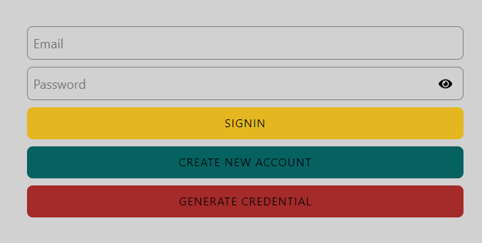
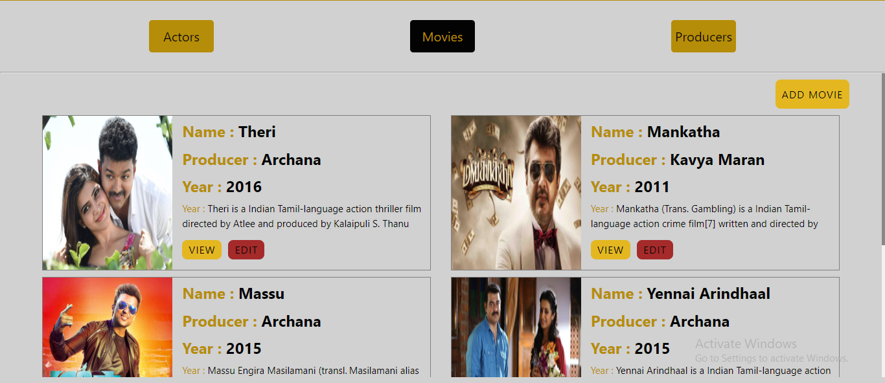
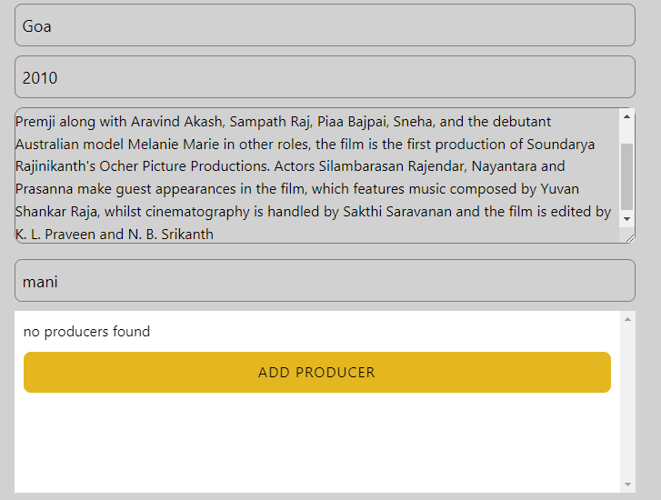
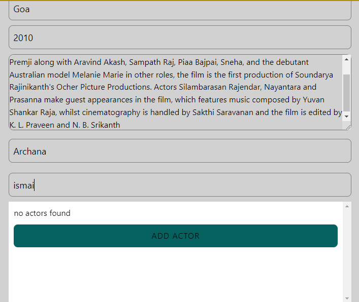

.

:star:This is the login page of imdb-clone web application.

Here you can see three buttons.

1.signin - to login to the web app. 
2.create new account- if you want to create a new account.click here this will route to register page. 
or else 
3.generate credential - this button is created for testing purpose.if you click this button this will autofill the login information. 

.

:star:This is the home page of imdb-clone web application.

Here you can see three button.

1.Actors - you can view all the actors. 
2.Movies - you can view all the movies. 
2.Producers - you can view all the Producers. 

:star: Each and every item you can see two button 
1.View - It will open the drawer and it gives the full description of the particular item. 
2.Edit - You can edit that particular item. 

 
:star: This is the page you can create a new movie. 
If the producer is not available in DB,you can add a new producer. 

:star: If the actor is not available in DB,you can add a new actor. 

:star:This is the topbar of this web application 
You can see two buttons on the right side 
1.To toggle the  theme (Dark theme- Light theme)
2.Logout Button
